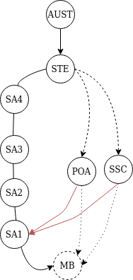

A friend of mine recently had a dataset provided to her that had statistics in it at the SA3 level. The work she does focuses on information based around  Suburbs and Local Government Areas. This SA3 data created a question for her. What Suburbs exists in what SA3's?  It's surprisingly difficult to answer this question quickly. In her case she needed an answer to this, because regular people who drive out to places, they don't go to SA3's. They go to suburbs and towns.

I've written in other posts about the ASGS and non ASGS regions and how they sort of overlap.  
The ABS has this big long article about the ASGS which is useful to read and understand if you deal with this stuff. [The ASGS](https://www.abs.gov.au/websitedbs/D3310114.nsf/home/Australian+Statistical+Geography+Standard+(ASGS)). 

Anyway, the ABS provides correspondences and allocation files which essentially create links from one boundary to another via big long spreadsheets. My friend solved her problem with one of these files. I helped, mostly by knowing the location of the files on data.gov.au. But it wasn't super easy information to find, and there was a Suburb -> Meshblock -> SA1-> SA2 -> SA3 matching process that she had to do with excel.

*cracks knuckles*

**Time to solve a sort of solved problem...maybe**

First off, I've got to find the data. And my god, it's very tricky to find ASGS allocation files. Usually, you'd head to ABS to find these things. But now the files live on https://data.gov.au. I didn't save the link when I helped my friend them, and it was actually pretty challenging finding them again a second time.

Good news, I found it. I'm zeroing in on the 2016 areas for this post. [ASGS Allocation Files (2016)](https://data.gov.au/dataset/ds-dga-d056f2ed-faa7-4140-b950-6cccfb72e3fd/details?q=asgs%20(2016)). 


**What I think I'm trying to build**

I think I want to build 
1. Something to consume the ASGS and turn it a graph.
2. Create a search webservice that interacts with that graph.
3. And for that graph to be storable so I can then use it like a database file.

If this seems vague, it is. Wish me luck.

**Starting**

I'm using Golang for this work. And everything should be in this repo [asgs-co-tree](https://github.com/gabesargeant/asgs-co-tree/).

The Node! The main idea with a tree or list data structure is the node that holds thing 'thing' in the list. I actually like Golang for not having generics and am happy to roll my own structures for this work.   
This is what I started with.

```
//AsgsRegionNode One region in all the regions, Let the nodes begin!
// This is a doubly linked node. ie it points up and down.
type AsgsRegionNode struct {
	RegionID      string
	RegionName    string
	LevelType     string
	LevelIDName   string
	ParentRegions []*AsgsRegionNode
	ChildRegions  []*AsgsRegionNode
}
```
My idea is to use this structure to create two tree's that join on the terminal leaves they share, ie MeshBlock regions. Something that looks like this. 

Note, the dotted lines are not included in the tree. Whilst Suburbs and postal areas fall under states, I haven't segmented them that way. As this graph doesn't have nodes that point at different types of children. If I did make those dotted lines solid in my program, the effect would be that an instance of a State Node would have up to three different region under it. This isn't such a problem, but it's extra complexity I don't want or need right now. 

**Tree Construction**

The allocation file has 75 columns of data and about 390K rows. It has a lot of repeats for non mesh bock information. This is unfortunately the only way you fit hierarchy information into a square file. So it ends up looking like this:
```   
MB(1) -> SA1 (X) -> SA2 (A) ->  SA3(H) -> SA4(P) -> STE(ACT) --> AUS
MB(2) -> SA1 (y) -> SA2 (A) ->  SA3(H) -> SA4(P) -> STE(ACT) --> AUS
MB(3) -> SA1 (z) -> SA2 (B) ->  SA3(H) -> SA4(P) -> STE(ACT) --> AUS
MB(4) -> SA1 (A) -> SA2 (C) ->  SA3(I) -> SA4(Q) -> STE(QLD) --> AUS
```

Each row contains relationship information on 1 unique Mesh block and every region that it relates to. Using this I can infer that all the other regions also relate to each other in that same row. 
In the very simple example above. The forth entry. Mesh Block 4, exists in SA1 A and up and up.   

To build up the tree of nodes I wrote up some state information into a few helper arrays in a second go file. [co-tree-default.go](https://github.com/gabesargeant/asgs-co-tree/blob/main/co-tree-default.go). This information is about what columns are of interest in the csv file, and what order I should build up the nodes from a row of data. And then some extra helper stuff. If I were to have a none generic Node struct I would probably use interfaces to to create a set of relationships between the regions and try and capture this inforamtion in a data structure rather than arrays.

Thankfully, building up the graph was rather simple. 
the following pseudo code covers the main logic for building the tree.

```

nodeMap = new Map[string]node

for each row in the CSV:

	for each level in the LevelSquence:

		//for this level get the asgs code and name;
		regionCode = levelCodeMap[level]
		regionName = levelNameMap[level]

		//from the current csv row get the region id 
		//for this asgs level.
		//See if it exists in the node map yet
		region = nodeMap[regionCode]

		if region is empty {
			
			build a new region,
			and set it's name and code
			and level info
		}

		// Add children to this element.
		// from the ChildLevelMap get child of this level. 
		// ie the child of a SA4 is a SA3
		childLevelForThisLevel = childLevelMap[level]
		
		//Special case 
		//if the child is a MB then it's child is ""
		if child == "" {
				nodeMap[currentLevel] = region
				continue
		}

		//for this level get the asgs code and name;
		childLevelCode = levelCodeMap[level]
		childLevelName = levelNameMap[level]

		childRegion = nodeMap[childLevelCode]

		//For this child set it's parent region 
		//to be pointer to the region 
		childRegion.ParentRegion = &region

		//set the region's child.
		region.ChildRegion = &childRegion.

		//Put the node back in the map
		
		nodeMap[regionID] = region
```

**Saving the tree**
It was very quick to get this far with the parser and generic file handling. 

When running the program before any of the search functionality I get the following timing from building the graph
```
~/Documents/git/src/asgs-co-tree$ time ./asgs-co-tree -i ASGS_2016_MBRD.csv 
Start
Attempting to read ASGS_2016_MBRD.csv 
Region Type: MB, size: 358009 
Region Type: SA3, size: 340 
Region Type: AUS, size: 1 
Region Type: SSC, size: 15286 
Region Type: LGA, size: 544 
Region Type: POA, size: 2668 
Region Type: SA1, size: 57490 
Region Type: SA2, size: 2292 
Region Type: SA4, size: 89 
Region Type: STATE, size: 9 
436232

real    0m5.935s
user    0m11.099s
sys     0m0.801s
```
It's obvious that the ~5 seconds is not an acceptable time to wait to consume the data file. I only want to do that once. I don't want to keep that structure in memory, or if I do get it into memory I want to lazily load it. 

**Saving the tree**

 [Golang GOB](https://golang.org/pkg/encoding/gob/) and [Golang JSON](https://golang.org/pkg/encoding/json/) all failed when I tried to write out those 436232 graph nodes to a file. I considered [Protobuf](https://pkg.go.dev/mod/google.golang.org/protobuf) but reading about it, I knew it would fail like the GOB package.

My initial idea was to just try and save 'memory' to a file, allowing me to then attach that memory back to a program at a point in the future. 

I should note, I don't often do a lot of manual memory stuff and was hoping this would be simpler than than my instincts were telling me.

Because the ASGS tree was essentially a ton of pointers. The way the GOB package serialized things meant that my design of having a double linked node, ie knowing about it's parents and children would create issues for the encoder. As each parent would encoded all of it's children and then all of it's parents recursively. How that works out is that every object would have an a copy of every other object. Rather than do this, the GOB package just errors out. And I learnt something new.

The error I got from the JSON package was Out of Memory, but it like wise had similar issues to the gob package. Initially this seemed odd considering people use massive json for everything these days. 

I tried a few things along the lines of removing all the pointer's from the nodes, and knocking out the parent links. This got the encoder to start writing to a file but also crashed out leaving a 1.7 gig json file as a partial output. 

From having a peak at the contents it seemed the removal of the pointers was a cause of this bloat (in addition to the json).

**Going for a walk with my dog**  

The next day I went for a walk with my dog, she enjoyed the walk, and so did I. I thought about the time complexity of recursing over the ASGS tree. 
Whilst I like having the *live* version with active pointers, storing it is complex. 

I know from talking with DB developers that storing tree like structures in a database requires careful thinking. Often you want to store associations in a way that has the least cardinality to maximize storage in a relational database. So for example, if a tree has node with only 1 parent, like a classic binary search tree, then you can store that tree in single table. The only thing you need to do is invert the "has a node" relationship and to make each child know it's parent instead of each parent know all their children. With this change, everything fits easily in a table.  
When you're reasoning about a tree on paper, you're usually starting from the top and working your way down, rather than building from the bottom up. Or at least most of my experience has been like this. Though my thinking is changing with experience.

Anyway, I walked and I thought. Eventually I thought instead of pointers, I could keep references to each child and parent region in arrays. 
 And I could stores the regions in a set of flat map objects. I pondered this for a bit but eventually....


 It's not rocket science, but I wasn't sure really what I wanted to do yet with the tree. 


 **Static references work.**  
 I implemented the tree to output essentially a giant map of node structs, each with references to its parents and children. I did switch to use maps rather than string arrays. This was to make use of the set-like features of maps. Thankfully, this worked, and was easy to do.  

 Thinking about how I want to put all this information into a service, I will probably end up using a storage layer like DynamoDB to hold the json. From my previous work with DynamoDB I know that the I want to create 'fat' objects. The idea behind this is to create a piece of data and then collect a constellation of similar data around it. This makes reads from DynamoDB richer, and make the client app less 'chatty' with the DB that is pay for request.

 As an example of this, In my mapping app I would return a table of data to the user and then let them slice and dice the topic locally before needing to request new content. In contrast to something like a regular Relational DB, where I'd probably lean towards making tighter calls for data due to how the query language works. 

 So what does a 'fat' or 'phat' ASGS node look like? I think it means having a lot of relative information locally present.

 **Step back and watch me de-normalize**

 I think I am going to revive the pointer based graph, and use it to build up a set of output nodes for the whole ASGS. I'd like to produce an output node that contain their position in the ASGS and the names of all of their ancestors up and down the graph.

Doing this would allow me to jump levels and If I used a storage layer like DynamoDB. I could potentially have a query execute like.
```
Get Suburb 'Sydney' 
> returns the Sydney suburb node, with information about what Mesh Blocks are in it. 
Get those MeshBlocks
```
For all of those blocks I could then merge their parents to get a list of all of the large structures they exists in, so if the Suburb of 'Sydney' exists across two boundaries higher up, then it would be visible. And then making a jump up a level would be just 1 jump rather than multiple.

If I don't include all the parent information then I can't just merge the lists, I have to walk from each Mesh Block all the way to the Australia region at the top of the tree. Or bottom of the tree, depending on which way you draw things. :)

Anyway, I'll try that and see if it works.

**It worked**
I generally knew this would work as I wasn't going to stop until it did. However the general process is, 

1. Put the regular ASGS tree together. Everything linked to all the Mesh Blocks. 
2. Then for every region in that tree build up an output node. 
3. Walk all the pointers up the parent chain to collect the ASGS areas above and then put those inside the output objects.
4. As Each region is produced, print it to a file in an output folder

The output objects look like this:

```

//OutputAsgsRegionNode is the final output format for each node.
type OutputAsgsRegionNode struct {
	RegionID      string
	RegionName    string
	LevelType     string
	LevelIDName   string
	ParentRegions map[string]*ParentRegion
	ChildRegions  map[string]string
}

//ParentRegion lighter parent structure
type ParentRegion struct {
	RegionID string
	RegionName string
	LevelType string
	ParentRegions map[string]*ParentRegion
}
```
The Parent regions do get a little nested, but I do capture pretty useful information along the way. And I finally got to use recursion for the first time since university. :P

Interestingly. The source CSV file is ~250MB as a 350K row csv. That skinny's down to ~430K 16MB worth of 0.5 -1.5kb json files. (this turns out to be way wrong)

The whole process takes around 1 minute to compute. The real performance win was to use maps to avoid duplicates in parent and child arrays. Before I figured that out it was taking around ~2-3 minutes to produce 1 node and this was from there being ~800 duplicates in the parents and child arrays.

**Hosting the files**  
~430K worth of files is a lot. I need to consider the UI or service layer im going to build. Thankfully the files are small. I'm very tempted to build a lambda function to add onto my exiting API gateway but back the lambda function with an S3 bucket for this content. That would fit in this website and because the files are 'tiny' like really really small, like smaller than the images on this page small. I can probably get away with it. 

I shall have a ponder. 

**S3, the AWS Golang SDK V2, my tears, and Linux ls and du OR Two days and 27 cents later.**

I had intended to get the content up and on to S3. The *expected* cost for the upload should be around ~5 bucks, which I'm willing to pay. But, I soon found out what I wasn't willing to pay was the upload speed. *You suck Australian Internet!* 
Getting the files up to AWS was slow! like really really slow. And I hit some odd issues along the way.

Just to recap, the input file, the ASGS allocation csv is about 250MB. After building the outputs, I had ~430K worth of files. Oddly the   
```> ll --block-size=MB ```   
command reported 16 MB. In real life, the size was 1.7 GB of output files. It seems with large numbers of files the **ls** command fails and it's better to use ```du```. [Thanks Kamil from Stack Overflow](https://unix.stackexchange.com/a/185765)

I tried a few other approaches to get stuff onto AWS.

Firstly, I wanted use the AWS golang SDK Version 2 that's currently in developer preview. I didn't love Version 1 and wanted to compare and contrast. Mostly to see if it was me or version 1. I went and got the new SDK and working out my approach when I saw the time, and decided to get some sleep.
The very next day before I had even attempted an upload, bang! the AWS Golang V2 SDK changed... Like overnight!, and it was a biggie. The 25 to 26 minor version number increment pretty much wrecked all my work. And if you go read the AWS gitter chanel about it. It seems a lot of people got a surprise as well.

I know that was a possibility with a developer preview however, I never thought that it would happen to me! :P

After that first failure, I then pivoted straight to google asking **s3 batch upload?** to which google said ... **Nope** щ(ಠ益ಠщ)

I did try the s3 synch command, that I read about on Stack Overflow. [Does the s3 API support uploading multiple objects in a single HTTP call?](https://stackoverflow.com/a/15050914)

Again, painfully slow internet came to haunt me. I didn't want to just let the process run and risk something stupid happening, like me having to miss out on two or three coffees due to a loop or something. I watched the s3 synch command for about 15 mins before calling it quits for the night and going to bed. 
I did get 45K worth of files up, and then get the charge for the ~27 cents for it.

Short story, AWS knows how to make money. There's no good shortcut. I did think about throwing up a zip file and then getting a ec2 or lambda to unzip it. But you still pay the cost of putting the items on S3. Also, the time saver element probably isn't there, with have to write the lambda or ec2 process and also risk making a mistake and paying twice or three times like I did when playing with DynamoDB.

**Pivoting**

I'm not giving up. I'm just not sure what to do now. I'm taking a few days to think.

I'm thinking I want to use the tree that I can build now, but to use it to output a graph that doesn't include mesh blocks. Something like this.

{{}}

That chops out a lot of extra mesh block junk from the output. About ~360K objects. Which makes S3, or Dynamo cheaper. But then, the discussion turns to what is the actual intent of what I'm building. And how important are those mesh blocks. 

In part two, I'll let you know what I come up with.


**Helpful stuff I never use enough to know by heart**  
[How To Find Largest Top 10 Files and Directories On Linux / UNIX / BSD](https://www.cyberciti.biz/faq/how-do-i-find-the-largest-filesdirectories-on-a-linuxunixbsd-filesystem/)